# Configuration management

## Question 1: Display All Ansible Configurations for a Host

> ⚠️ 
> **Environment Note**: Docker was used to replicate the suggested environment:  
> - Ubuntu 20.04 LTS  
> - Ansible 2.9.16  
> - Puppet 4.5+  

To display all Ansible-related configurations and facts (variables prefixed with ansible_) for a specific host, use one of these commands:

```bash
ansible <hostname> -m setup
```
Purpose: Displays all gathered system facts (OS, network, hardware)

Output:

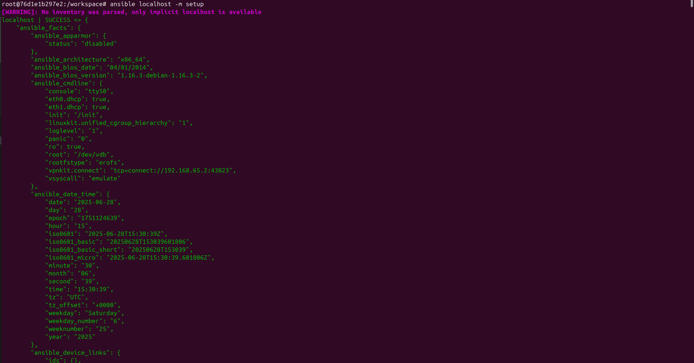

## Question 2: Please configure a cron job that runs logrotate on all machines every 10 minutes between 2h - 4h.


> ⚠️ 
> **Environment Note**: A Virtual Machine was set up just to test the playbook.
## Ansible Playbook

### The ansible playbook set can be found here: 
[logrotate-cron.yml](Ansible_Files/logrotate-cron.yml)

Output:

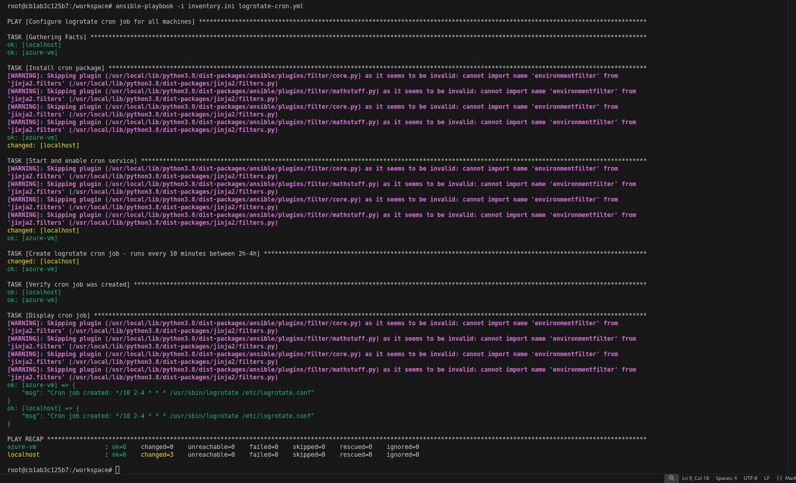

Inside Docker Container:

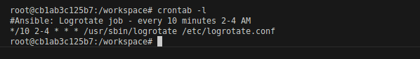

Inside VM:

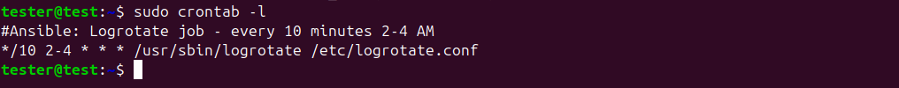


## Question 3: Please deploy ntpd package to the following 3 servers:
    app-vm1.fra1.internal (192.168.0.2)
    db-vm1.fra1.db (192.168.0.3)
    web-vm1.fra1.web (192.168.0.4)
    
with custom config of /etc/ntpd.conf:
```
tinker panic 0
restrict default kod nomodify notrap nopeer noquery
restrict -6 default kod nomodify notrap nopeer noquery
restrict 127.0.0.1
restrict -6 ::1
server   192.168.0.252 minpoll 4 maxpoll 8
server   192.168.0.251 minpoll 4 maxpoll 8
server   192.168.0.0 # local clock
fudge    192.168.0.0 stratum 10
driftfile /var/lib/ntp/drift
keys     /etc/ntp/keys
```

### Ansible Playbook

### The ansible playbook set can be found here: 
[ntpd_deployment.yml](Ansible_Files/ntpd_deployment.yml)

> ⚠️ Environment Limitations:

The playbook was tested in a local/lab environment
The configured NTP servers (192.168.0.252, 192.168.0.251) are not reachable in this test setup
The ntpq -p output shows servers in .INIT. state with reach 0, indicating no connectivity

Requirements for Full Functionality:

Target Servers: The three specified VMs must exist and be accessible:

- app-vm1.fra1.internal (192.168.0.2)
- db-vm1.fra1.internal (192.168.0.3)
- web-vm1.fra1.web (192.168.0.4)


NTP Infrastructure: For the configuration to work properly, these are needed need:

- NTP servers running at 192.168.0.252 and 192.168.0.251
- Network connectivity between all VMs


Alternative for Testing: To test NTP functionality, replace the server configuration with > public NTP servers:
- server 0.pool.ntp.org
- server 1.pool.ntp.org
- server 2.pool.ntp.org
### Output

Output after applying the playbook:

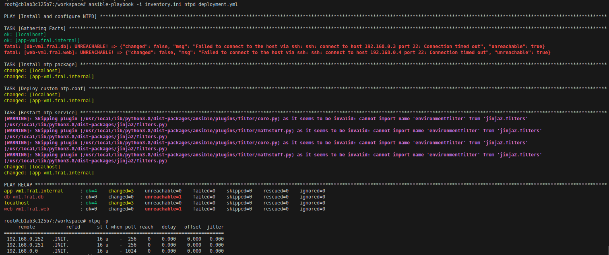


Inside the Virtual Machine:

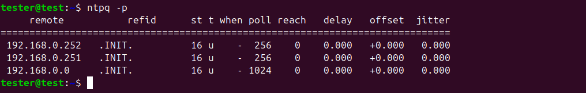

## Question 3: Deploy monitoring template onto our nagios server “monitoring.fra1.internal”, each of the above machines should use the following nagios templates:

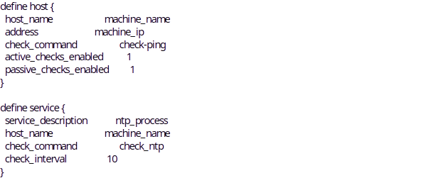

### Ansible Playbook

### The ansible playbook set can be found here: 
[nagios_monitoring.yml](Ansible_Files/nagios_monitoring.yml)

Output after applying the playbook:


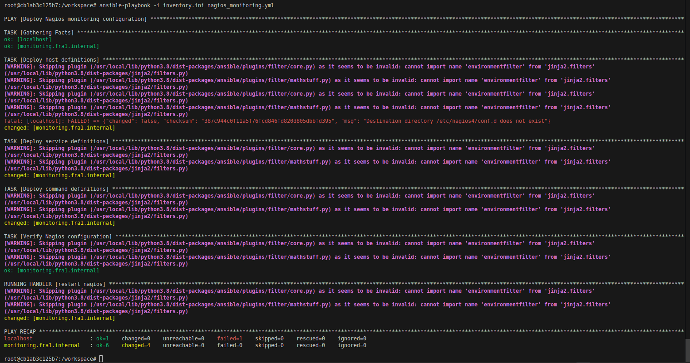

# Docker/Kubernetes

   ## 1) Prepare a docker-compose for a nginx server.
    Requirements:
    • nginx logs need to survive between nginx container restarts
    • docker should use network bridge subnet 172.20.8.0/24

Docker Compose File: 


```
version: '3.8'

services:
  nginx:
    image: nginx:latest
    container_name: nginx-server
    ports:
      - "80:80"
      - "443:443"
    volumes:
      # Mount nginx logs to host for persistence
      - ./nginx-logs:/var/log/nginx
      # Optional: Mount custom nginx config if needed
      # - ./nginx.conf:/etc/nginx/nginx.conf:ro
      # - ./html:/usr/share/nginx/html:ro
    networks:
      - nginx-network
    restart: unless-stopped

networks:
  nginx-network:
    driver: bridge
    ipam:
      config:
        - subnet: 172.20.8.0/24
```

1. Start the server

```
docker compose up -d
```
2. Visit Nginx in browser

```
http://localhost
```

3. Check logs

Logs are stored in the nginx-logs/ folder on the host

4. Restart the container


```
docker compose restart nginx
```

Logs still present inside nginx-logs/ folder on the host

As youi can see the previous logs and new logs are all there
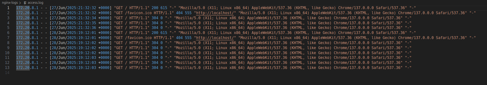

## 2. Which Kubernetes command you will use to identify the reason for a pod restart in the project "internal" under namespace "production".

### Answer

```
kubectl describe pod -n production -l project=internal
```
-n production: The target namespace

-l project=internal: Filters pods with the label.

## 3. Consider the following scenario

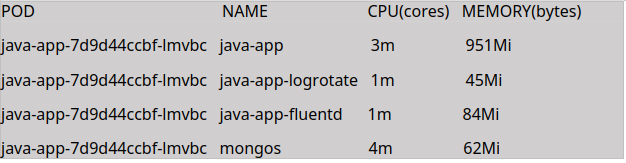

Application pod has the following resource quota:

    • Memory request & limit: 1000 & 1500
    • CPU request & limit: 1000 & 2000
    • Xmx of 1000M
Java-app keep restarting at random.  From Kubernetes configuration perspective, what are the possible reasons for the pod restarts?

### Answer

After taking a close look at the metrics and configuration, The root cause is msot l;ikely be memory related.

1. Memory Issues

The current usage for the pods are
Current usage: 951Mi + 45Mi + 84Mi + 62Mi = 1142Mi total

We have a Memory limit: 1500Mi and Java Xmx: 1000M (≈1000Mi).

The Java app alone is using 951Mi, that is very close to Xmx of 1000M. 

With JVM overhead (non-heap memory, metaspace, direct memory, etc.), the total memory consumption likely exceeds the 1000Mi request and may spike above the 1500Mi limit.

Root Cause:

JVM memory usage = Heap (Xmx) + Non-heap + Overhead

Non-heap includes: Metaspace, CodeCache, Compressed Class Space, Direct Memory

Sop the total JVM memory often 20-40% higher than Xmx setting.

Looking at the description of the pod would help too.

```
kubectl describe pod java-app-7d9d44ccbf-lmvbc -n <namespace>
```

## Helm
Here is the screenshot of the pods inside a k8s cluster

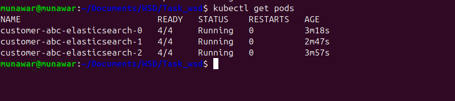

Here is the screenshot of the statefulsets inside a k8s cluster


### The updated stateful set can be found here: 
[customer-abc-elasticsearch.yaml](Helm/customer-abc-elasticsearch.yaml)

## Metrics

## 1. Explain how Prometheus work.

Prometheus is essentially a metrics collector that's always asking "how are you doing?" to your applications and infrastructure. Think of it like a health inspector making regular rounds. It uses pul based monitoring mechanism that operates b ased ib time-series data model.

Core Architecture:
* Prometheus Server: The main component that scrapes and stores metrics data
* Time Series Database: Stores metrics with timestamps and labels
* Pull Model: Prometheus actively scrapes metrics from configured targets at regular intervals
* Service Discovery: Automatically discovers targets through various mechanisms (Kubernetes, Consul, file-based, etc.)

The way it works is pretty straightforward - instead of your applications having to remember to send metrics somewhere (which they often forget to do), Prometheus goes out and pulls the data itself. Every 15 seconds or so, it hits your application's /metrics endpoint and grabs whatever metrics you're exposing.

Query Language (PromQL): The real magic happens with PromQL - it's like SQL for metrics. You can do calculations, aggregations, and spot trends that would be impossible to see just looking at raw numbers.

## 2. How do you create custom Prometheus alerts and alerting rules for Kubernetes monitoring? Provide an example alert rule and its configuration.

Custom alerts are defined in Prometheus using alerting rules written in YAML and grouped into rule files, usually managed through the prometheus.rules or prometheusRule custom resource.

### Creating Custom Prometheus Alerts for Kubernetes

1. Create a YAML file named prometheus-rules.yaml with Prometheus' Alertmanager syntax:

```
groups:
- name: kubernetes-alerts
  rules:

  # Alert 1: Pod CrashLooping
  - alert: CrashLoopBackOff
    expr: kube_pod_container_status_waiting_reason{reason="CrashLoopBackOff"} == 1
    for: 5m
    labels:
      severity: critical
    annotations:
      summary: "Pod {{ $labels.pod }} in CrashLoopBackOff (Namespace: {{ $labels.namespace }})"
      description: "Pod {{ $labels.pod }} is restarting repeatedly."

  # Alert 2: Node Memory Pressure
  - alert: NodeMemoryPressure
    expr: node_memory_MemAvailable_bytes / node_memory_MemTotal_bytes * 100 < 10
    for: 15m
    labels:
      severity: warning
    annotations:
      summary: "Node {{ $labels.instance }} memory critically low ({{ $value }}% available)"
```
2. Deploy Rules to Kubernetes

```
kubectl apply -f prometheus-rules.yaml -n monitoring
```

## 3. What is the Prometheus query you can use in Granfana to properly show usage trend of an application metric that is a counter?

For a counter we can use rate () and increase().
Suppose we have http_requests_total as a counter.

So the PromQL would be:

```
rate(http_requests_total[5m]) * 60 * 5
```
It calculates the per-second average request rate over a 5-minute window.

## Databases

### 1. Cassandra

Query to db cluster returns different result each time.  Users reported query result has data records that they deleted days ago.  
Explain what the likely reason for the behavior and how to avoid it.

### Answer:
This is mainly caused by eventual consistency or replication lag in a distributed database cluster.

### Cause:
 **Eventual consistency** is common in a distributed database cluster like Cassandra. When users delete records, the deletion happens on one node but hasn't propagated to all replicas yet. Your application is probably hitting different database nodes on each query, which is why you're getting inconsistent results. You can think of it like deleting a file from a shared computer space but that file still remains on everyother computer until the system sync up. 

The queries ueries are hitting different nodes in the cluster, and they haven't all received the tombstone yet. Node A knows the data is deleted, Node B is still serving the old data.

 ### Solution

 ### Using higher consistency levels

 We can use read and write consistency levels from the default ONE to QUORUM. Instead of accepting responses from any single replica, require majority consensus. When deleting data, ensure at least 2 out of 3 replicas (in a typical RF=3 setup) acknowledge the delete before confirming success. For reads, query multiple replicas and return data only when majority agree.

### Implement Soft Deletes

 Replace DELETE operations with UPDATE statements that mark records with an "is_deleted" flag or timestamp, then filter these records in application queries; this approach works around Cassandra's eventual consistency by treating deletes as regular writes that propagate normally, providing immediate consistency while requiring schema changes and ongoing storage management.

### Be mindful of the tombstone grace period
Cassandra retains tombstones for a set amount of time, it is by default 10 days. If repairs aren’t done during this time, a replica that missed the delete might later consider the original data valid again — effectively "undoing" the delete.

### 2. Mongo

### Answer
## Step-by-Step Process

### 1. Connect to the mongos router

```bash
mongo --host <mongos-hostname>:27017
```

### 2.  Add Shards to the Cluster
We need to add the two replica sets as Shards

```bash
sh.addShard("replicaset_1/host1:27017,host2:27017,host3:27017")
sh.addShard("replicaset_2/host4:27017,host5:27017,host6:27017")
```
> need to replace host with actgual hostname.

### 3. Verifying the Sharding Status

We can verify the sharding status with this command -->

```
sh.status()

```

### 4. Enable Sharding for the Database

Enable sharding for the sanfrancisco database:

```
sh.enableSharding("sanfrancisco")
```

### 5. Create an Index on the Shard Key
Ensure there is an index on _id
```
use sanfrancisco
db.company_name.createIndex({"_id": 1})
```

### 6. Shard the Collection on _id

```
sh.shardCollection("sanfrancisco.company_name", {"_id": 1})
```


### 7. Verify Sharding Configuration

```
sh.status()
```
Look for the sanfrancisco.company_name collection in the output to confirm it's sharded.

